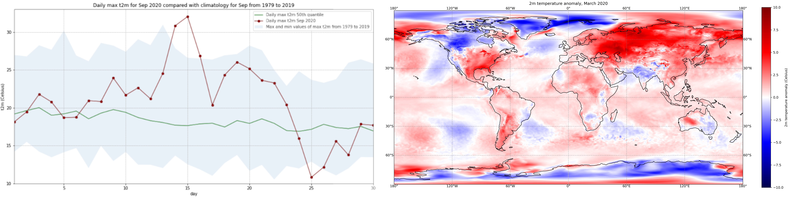

<br>

# Copernicus Climate Change Service (C3S) Data Tutorials

***Discover how to access and handle data of the past, present and future climate!***

This website contains Jupyter notebook based tutorials that demonstrate how to access and process the wide variety of climate data provided by the [Climate Data Store (CDS)](https://cds.climate.copernicus.eu/) of the [Copernicus Climate Change Service (C3S)](https://climate.copernicus.eu/). Each tutorial provides interactive examples of common workflows to derive information about the past, present and future climate. They include code in Python and content in Markdown to provide clear, engaging and practical instructions on data handling which can be run in various cloud environments without any need for installation. You are invited to experiment with these tutorials and tailor them to your needs to extract results meaningful to you! The tutorials make use of climate data freely available on the CDS and accessed using an Application Programming Interface (API).



## How to run these tutorials

The tutorials are in the form of [Jupyter notebooks](https://jupyter.org/). At the top of each notebook you will find links to a selection of cloud-based services to run, edit, export or create new notebooks. These include the following:

|Binder|Kaggle|Colab|
|:-:|:-:|:-:|
|[](https://mybinder.org/)|[](https://www.kaggle.com/code)|[](https://colab.research.google.com/)|
|Binder may take some time to load, so please be patient!                                           |Requires (free) registration with Kaggle. Once in, "switch on the internet" via settings           |Requires Google account, and installation of some libraries, such as Cartopy `!pip install cartopy`|

If you would like to run this notebook in your own environment, we suggest you install [Anaconda](https://docs.anaconda.com/anaconda/install/), which contains most of the libraries you will need. You will also need to install [Xarray](http://xarray.pydata.org/en/stable/) for working with multidimensional data in netcdf files, and the CDS API (`pip install cdsapi`) for downloading data programatically from the CDS.

```{note}
These tutorials provide practical guides on data processing. They can be run without need for installation, and can be fully adapted to suit your needs!
```

## Contents

Please browse through the tutorials listed below, or make use of the search function to look for specific topics or data processing workflows of interest.

```{tableofcontents}
```